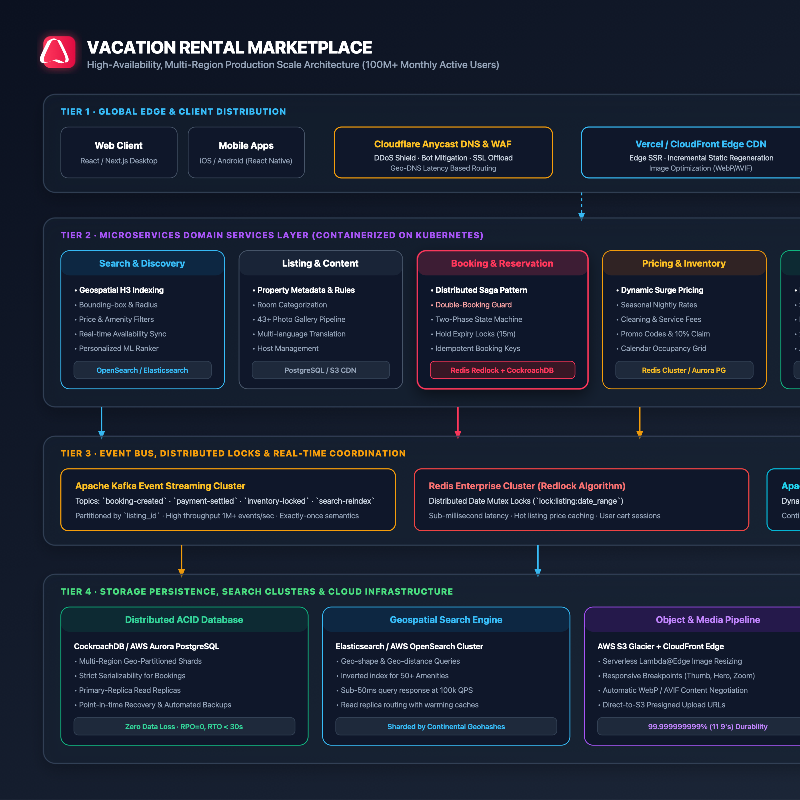

# Vacation Rental Marketplace: Production-Scale Architecture

This document provides the high-level system design, scaling strategy, and resilience architecture for a global, production-scale vacation-rental marketplace (handling **100M+ Monthly Active Users**, **1M+ concurrent search queries**, and **100k+ simultaneous booking transactions**).

---

## 1. High-Level Architecture Diagram

The system is organized into a four-tier distributed topology with multi-region active-active redundancy:

---

## 2. Tier-by-Tier Scaling Strategy

### Tier 1: Global Edge & Client Distribution

- **Edge CDN & WAF (Cloudflare / CloudFront)**:
  - Anycast DNS routing directing user requests to the nearest edge Point of Presence (PoP).
  - DDoS shielding, Web Application Firewall (WAF), and automated bot challenge mitigation.
  - TLS termination at the edge with HTTP/3 (QUIC) support.
- **Frontend Presentation Layer**:
  - React / Next.js Desktop client with static asset caching (`Cache-Control: public, max-age=31536000, immutable`).
  - Incremental Static Regeneration (ISR) for high-traffic listing pages (e.g. revalidating every 60 seconds or on listing update webhooks).
  - Responsive media delivery with automated WebP/AVIF format negotiation based on `Accept` header.
- **API Gateway & Routing Layer (Kong / Envoy)**:
  - Apollo GraphQL Federation Router unifying domain microservice schemas into a single graph.
  - Token Bucket rate limiting per IP / authenticated user ID.
  - OAuth2 / JWT stateless authentication with edge revocation check.

---

### Tier 2: Domain Microservices Layer (Containerized on Kubernetes)

The backend business logic is divided into decoupled domain services communicating via gRPC internally and GraphQL/REST externally:

1. **Search & Discovery Service**:
   - Manages geospatial queries, proximity search, availability date filters, and guest capacity.
   - Leverages **Uber H3 spatial indexing** (hierarchical hexagonal spatial index) to query listings within dynamic map bounding boxes.
   - Machine Learning-powered listing ranking based on guest preferences, host response rate, and price competitiveness.

2. **Listing & Content Service**:
   - Source of truth for property configurations, 43+ photo gallery metadata, house rules, and amenities.
   - Automated multi-language translation pipeline via asynchronous message queues.

3. **Booking & Reservation Service (The Core Transaction Engine)**:
   - Implements the **Distributed Saga Pattern** (Orchestrator-based) to coordinate reservation holds, payment processing, inventory confirmation, and notification delivery.
   - **Double-Booking Elimination**: Utilizes a Two-Phase Reservation Protocol:
     1. Phase 1 (*Hold*): Temporarily acquire a distributed lock on the date range for 15 minutes using the **Redis Redlock** algorithm.
     2. Phase 2 (*Commit*): Once the Payment Service confirms settlement, commit the booking with strict serializability in the primary database.

4. **Pricing & Dynamic Inventory Service**:
   - Calculates dynamic nightly pricing, seasonal premiums, cleaning fees, and service charges.
   - Applies active coupon codes (e.g. "10% off claim").
   - Maintains a 365-day availability bitmap per listing for $O(1)$ range collision checks.

5. **Payments & Escrow Service**:
   - PCI-DSS Level 1 compliant tokenization vault integrating Stripe and regional payment gateways.
   - Escrow hold mechanism: funds are held in escrow until 24 hours post guest check-in before releasing payouts to hosts.

6. **Reviews & Trust Engine**:
   - Double-blind review submission (reviews are revealed only when both parties submit or after 14 days).
   - Automated calculation of the **Guest Favourite** badge, Superhost status, and category rating breakdowns (Cleanliness, Accuracy, Check-in, Communication, Location, Value).

---

### Tier 3: Distributed Event Bus & Coordination Layer

- **Apache Kafka Event Streaming Cluster**:
  - Serves as the central immutable event log for asynchronous workflows.
  - Partitioned by `listing_id` to guarantee ordered message delivery for any individual property.
  - Topics include: `booking.initiated`, `booking.confirmed`, `payment.settled`, `listing.updated`, `search.reindex`.
  - Exactly-once processing semantics enabled via transactional producers and idempotent consumers.
- **Redis Enterprise Cluster**:
  - In-memory distributed lock manager implementing the **Redlock algorithm** across 5 independent Redis instances to guard against split-brain scenarios.
  - Real-time caching of popular listing previews and calendar availability bitmaps with sub-millisecond retrieval.
- **Apache Flink Real-Time Stream Processor**:
  - Continuously processes Change Data Capture (CDC) events from databases via Debezium.
  - Propagates database mutations to Elasticsearch clusters with sub-second replication lag.

---

### Tier 4: Storage, Persistence & Cloud Infrastructure

- **Distributed ACID Relational Database**:
  - CockroachDB / AWS Aurora PostgreSQL multi-region cluster with geo-partitioned tables.
  - Strict serializability isolation level for reservation tables prevents phantom reads and race conditions.
  - High availability with automated failover: RPO = 0 (zero data loss) and RTO < 30 seconds.
- **Geospatial Search Engine**:
  - Elasticsearch / AWS OpenSearch clusters sharded by continental geohashes.
  - Inverted indexes for fast filtering across 50+ amenities (Jacuzzi, Wifi, Pool, Kitchen).
  - Dedicated read replicas with warmed query caches serving 100k+ QPS with <50ms P99 latency.
- **Object Storage & Media Pipeline**:
  - AWS S3 multi-region bucket with CloudFront edge caching.
  - Serverless Lambda@Edge image processing generating optimized thumbnails and hero images on-the-fly.
  - 99.999999999% (11 9's) data durability.
- **Kubernetes Deployment Infrastructure**:
  - Multi-region AWS EKS / Google GKE clusters deployed via **Terraform Infrastructure as Code**.
  - **ArgoCD GitOps** controller managing declarative releases.
  - **Karpenter** and **Horizontal Pod Autoscalers (HPA)** automatically scaling compute capacity based on CPU, memory, and custom Kafka lag metrics.
  - **Istio Service Mesh** enforcing mutual TLS (mTLS) encryption and facilitating canary traffic splitting (1% -> 10% -> 50% -> 100%).
  - **Observability**: OpenTelemetry distributed tracing correlated with Datadog APM and Prometheus metrics.

---

## 3. Summary: Scalability Matrix

| Dimension | Target Metric | Architectural Solution |
| :--- | :--- | :--- |
| **Search QPS** | 100,000+ QPS | OpenSearch clusters with geohash sharding & edge query caching |
| **Booking Contention** | 0 Double-Bookings | Redis Redlock distributed date mutex + Serialized DB transactions |
| **P99 Read Latency** | < 100ms globally | Anycast routing + CloudFront edge caching + Redis cluster |
| **Media Delivery** | Millions of photos | S3 + CloudFront CDN + On-demand Lambda WebP/AVIF compression |
| **Disaster Recovery** | Multi-region active-active | CockroachDB cross-region consensus + Route 53 health check failover |
